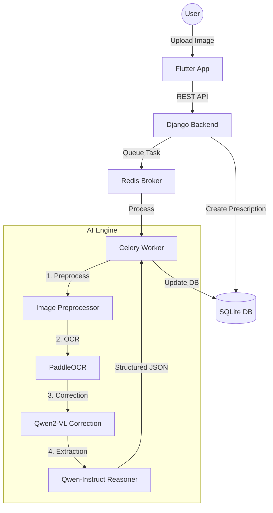

# Project Analysis: MEDMATE (Smart Medicine Companion)

## System Overview
**MEDMATE** is an AI-powered healthcare ecosystem designed to simplify prescription management for patients. The system allows users to photograph medical prescriptions, automatically extracts structured medicine data using a sophisticated AI pipeline, and provides automated medication reminders. 

### Primary Objectives
- **Digitization**: Convert handwritten or printed prescriptions into structured digital records.
- **Automation**: Use computer vision and LLMs to eliminate manual data entry of medications.
- **Safety**: Provide a "Medicine Companion" that tracks dosages and schedules via notifications.

### Key Stakeholders
- **Patients/Users**: Primary users of the mobile application.
- **Developers/Maintainers**: Responsible for the AI model lifecycle and backend stability.

---

## Architectural Decomposition
The system follows a modern decoupled architecture consisting of three primary layers:

### 1. Mobile Frontend (Flutter)
- **Responsibilities**: User authentication, prescription uploading (camera/gallery), medicine listing, and local notification scheduling.
- **Core Components**: 
    - `ApiService`: Handles REST communication with the backend.
    - `NotificationService`: Manages local device reminders.
    - `DashboardScreen`: Central hub for user activity.

### 2. Backend API (Django REST Framework)
- **Responsibilities**: Data persistence, user management, and AI task orchestration.
- **Core Apps**:
    - `users`: Custom user models and JWT-based authentication.
    - `prescriptions`: Manages the lifecycle of Prescription and Medicine entities.
    - `ai_engine`: A specialized module providing the interface to the AI infrastructure.

### 3. AI Processing Engine (Celery + LLMs)
- **Responsibilities**: Heavy-lift computation for OCR and medical reasoning.
- **Components**:
    - **Worker Node**: Executes asynchronous tasks queued by the API.
    - **Pipeline**: A multi-stage sequence (PaddleOCR → Qwen2-VL → Qwen-Instruct).

---

## Data Flow and Control Flow

### Tracing a Prescription Upload
1.  **Capture**: The Flutter app captures an image and sends a `POST` request to `/api/prescriptions/upload/`.
2.  **Staging**: Django saves the image to storage and creates a `Prescription` record with status `pending`.
3.  **Trigger**: Upon successful DB commit, a Celery task `process_prescription_ai` is dispatched.
4.  **Locking**: The Celery worker acquires a pessimistic lock (`select_for_update`) to prevent duplicate processing.
5.  **AI Pipeline**:
    -   **OCR**: PaddleOCR extracts raw text blobs.
    -   **Vision Correction**: Qwen2-VL looks at the image + raw text to fix errors (e.g., "Am0x" → "Amoxicillin").
    -   **Medical Reasoning**: Qwen-Instruct parses the corrected text into `Medicine` objects (Name, Dosage, Frequency).
6.  **Persistence**: The worker saves the structured medicines to the database and marks the prescription as `processed`.
7.  **Synchronization**: The Flutter app polls or refreshes to display the extracted medication list.

---

## Design Patterns and Decisions
- **Asynchronous Task Queue**: Ensures the mobile app remains responsive while the heavy AI pipeline (which can take several seconds) runs in the background.
- **Multi-Stage AI Pipeline**: Uses a "Corrective Vision" approach. Instead of relying on a single model, it uses a fast OCR for initial extraction and a heavy Vision-Language Model (VLM) for error correction, improving accuracy for handwritten notes.
- **Pessimistic Locking**: Uses `select_for_update` in the task worker to handle race conditions where multiple tasks might attempt to process the same prescription.
- **Transaction Guards**: Uses `transaction.on_commit` in Django views to ensure Celery tasks only start *after* the database record is guaranteed to exist.

---

## Data Management
- **Relational Model**: Uses `Prescription` (parent) and `Medicine` (child) entities with a one-to-many relationship.
- **State Machine**: Prescriptions move through states: `pending` → `processing` → `processed` (or `processed_empty` / `failed`).
- **Storage**: Image files are stored in the `media/` directory, while metadata and extracted text are in SQLite.

---

## Security and Reliability
- **Authentication**: JWT (JSON Web Tokens) with a refresh token rotation mechanism for secure, long-lived sessions on mobile.
- **Task Reliability**: Celery `autoretry_for` handles transient AI errors (e.g., CUDA OOM or vision model timeouts) with exponential backoff.
- **Input Sanitization**: A `safe_str` utility guards against malicious or corrupt text returned by LLMs before it reaches the database.

---

## Performance and Scalability
- **Horizontal Scaling**: The AI engine can be scaled by adding more Celery workers with GPUs without modification to the core API.
- **Model Preloading**: The `MedMatePipeline` uses a background singleton to preload heavy models (Paddle/Qwen) into VRAM on worker startup, avoiding the 10-20s load time per request.

---

## Potential Issues and Improvements
1.  **Database Scalability**: As the user base grows, SQLite should be migrated to PostgreSQL to support higher concurrency.
2.  **Notification Logic**: Currently, reminders are scheduled locally on the device. Syncing these with the backend would allow for cross-device consistency.
3.  **Real-time Updates**: Implementing WebSockets (Django Channels) would allow the backend to "push" the processed results to the app instantly, removing the need for polling.

---

## Conclusion
MEDMATE is a robust, well-architected system that effectively bridges the gap between medical documents and digital management. By leveraging a multi-model AI pipeline and a reliable asynchronous backend, it provides a premium user experience while maintaining high standards for data integrity and system response times.
